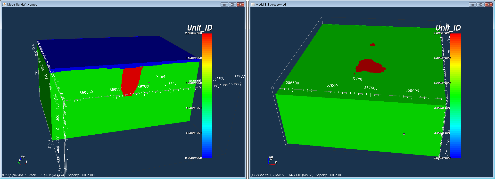
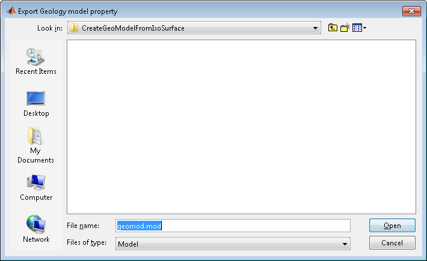

.. _propModelFromGeoModel:

.. include:: <isonum.txt>

Create a physical property model from a geologic model
======================================================

In GIFtools, a geologic model can be edited to generate a physical property model. This recipe goes through the steps to do so. To start, a GEOmodel is required. A geology model can be created in :ref:`Model Builder <createModelBuilder>` (e.g., :ref:`from an isosurface <IsoSurfaceToGeoModel>`).

The example being used throughout this recipe is based on a GEOmodel created from an isosurface of a susceptibility model. This particular geologic model contains three units: (0) air, (1) the background, and (2) the anomalies, as shown in the figure below.

Any geology model will have a geologic definition. To edit the definition, use the menu for the geology model: **Geology Model** |rarr| **Geology definition** |rarr| **Edit**. 

This brings up the following window:

.. figure:: ../../../images/createModFromGeo/geodef.png
    :align: center
    :figwidth: 100%

Currently, there are no physical properties assigned to each of the units. The units have the header "Index" and in this example there are 3. Click on "Add column" to add a column for physical properties. A window will appear, prompting for the name of the new column:

Enter the desired name. For this example, the name used is "susValue". Click "Value" if the column will contain numbers (e.g., conductivity values) or "String" if the column will contain words (e.g., rock names). Here we are interested in physical property values so we click "Value". The window will close and the new column appears in the geology definition, as shown below:

Now we can add values to the new column "susValue". In this case, we are assigning susceptibility values.

#. Index 0: 0 SI |rarr| air
#. Index 1: 0 SI |rarr| background
#. Index 2: 0.003 SI |rarr| anomalies

.. tip:: Make sure to hit "Tab", hit "Enter", or click in another cell to register each value in the appropriate cell.

Let's add a second column for a different physical property. Repeat the above steps to add a column, name it, and assign the values. For this example, the second column is called "conValue" and contains the following conductivity values:

#. Index 0: 1E-8 S/m |rarr| air
#. Index 1: 0.005 S/m |rarr| background
#. Index 2: 0.1 S/m |rarr| anomalies

The table will now look like this:

Click OK when finished and the geology definition table will close.

The next step is to set the I/O header for the physical property. With the GEOmodel highlighted, use the menu: **Geology Model** |rarr| **Geology definition** |rarr| **Set I/O headers**.

This brings up a window to set or change the I/O headers for the Geology ID, Property, Lower Bound, Upper Bounds, and Smallest model component. The drop down menus for each header will show the available geology definitions, including the two we just created (susValue and conValue).

For Property, select the desired geology definition. In our example, we've chosen conValue. Click OK when done. The window will close and the info panel for the GEOmodel will update, reflecting that the property has been set to conValue:

Now we can create the physical property model. There are two ways to do this.

1. With the GEOmodel highlighted, use the menu to create a model: **Geology Model** |rarr| **Create model** |rarr| **From property values**. This adds a GIFmodel to the Model Builder folder. In our example, the name of the GIFmodel is geomod_conValue.

2. The second way directly exports the physical property model. With the GEOmodel highlighted, use the menu: **Geology Model** |rarr| **Export** |rarr| **Active property**. A window asking for the desired filename and file location will pop up. Navigate to where you want to save the model and click Open.

.. note:: Note that the name of the model is automatically that of the GEOmodel, even though we are exporting the active property! However, the suffix is "mod", indicating a GIFmodel rather than a GEOmodel (which, when exported, has the suffix "geo" and an accompanying definition file with the suffix "def").

.. note:: When exporting an active property model, the model will not appear as an item in the Model Builder folder. The model can be imported into GIFtools using :ref:`the import functionality <importModel>`.

To generate the physical property model for a different property (e.g., susValue), navigate the menu to set the I/O headers for the GEOmodel. For "Property", select a different property. In this case, we set susValue instead of conValue. Click OK. The info panel for the GEOmodel will be updated as following:

To create the physical property model, repeat the above steps. Using the first method will generate "geomod_susValue (GIFmodel)" in the Model Builder folder and the second method will allow the model to be directly exported.

When visualizing the model (in this case, the susceptibility model in MeshTools 3D), we see the anomalous units with a susceptibility of 0.003 SI in a zero background.

.. example:: Continue with the `example <http://www.eoas.ubc.ca/~sdevries/GIFtoolsExamples/CreateGeoModelFromImage_Example.zip>`__ from the :ref:`recipe on creating a geologic model <imageInInversion>` and create physical property models using this recipe.

.. example:: This `download <http://www.eoas.ubc.ca/~sdevries/GIFtoolsExamples/CreatePhysPropModelFromGeoImage_Example.zip>`_ also allows you to step through the :ref:`recipe on creating a geologic model from a geologic image <imageInInversion>` and then use this recipe to create a physical property model.

