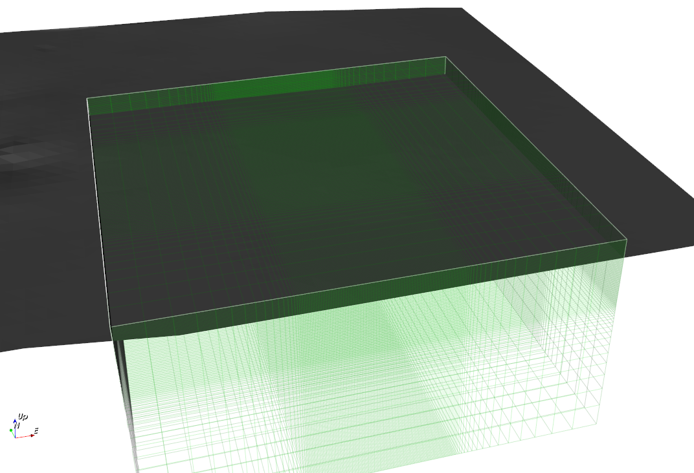
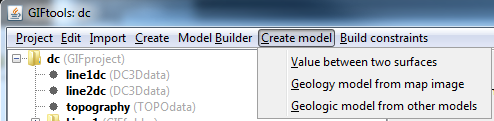
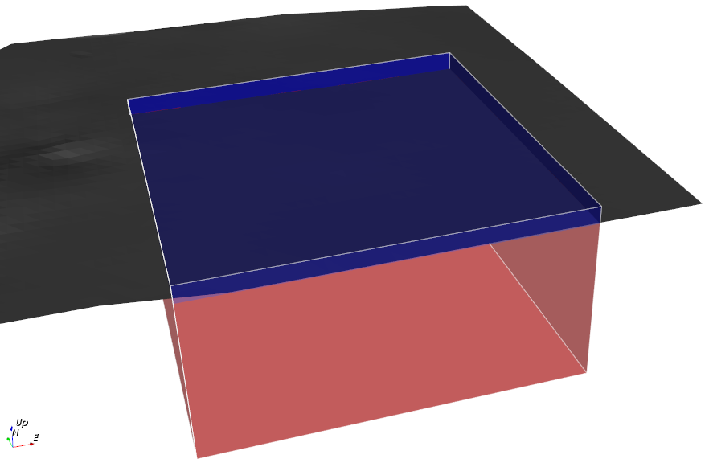

.. _SurfaceInInversion:

.. include:: <isonum.txt>

Use a surface (or surfaces) in an inversion
===========================================

In GIFtools, surfaces are imported and used to create or edit a geology model. This allows one to set bounds, weights, and a physical property based on the geology ID. This is particularly useful for inversion of multiple data types in the same area. Below are the steps to put information from a surface (or surfaces) in an inversion.

**NOTE:** In future releases of GIFtools, this functionality will be streamlined in a :ref:`inversion workflow <createWorkflowInversion>`. For now, the surface(s) and :ref:`modelBuilder module <createModelBuilder>` are required. Below are details of the step required to create reference models, bounds, etc from a surface.

1. :ref:`Import a surface <importSurface>` or surfaces (import each surface individually). Below is a surface and mesh used in this example.

   

2. :ref:`Create <createModelBuilder>` or click an already created modelBuilder module.

3. Within the modelbuilder module use the menu below, even if only using one surface. Create or edit a geology model using the dialog found through the menu:

   **Create** |rarr| **Model** |rarr| **Value between two surfaces**

.. End of figure

     **NOTES on step 3:**

     - If creating a geology model, it is recommended to use "2" as the anomalous unit integer. Unit 1 is the background normal space and Unit 0 (if present) is reserved for air. 

     - Select the value between two surfaces even if you only have one surface (the second will be the topography or a value in depth)

     - To continue the surface to depth (or above), use the "value" option and give an elevation. To continue the unit to the bottom of the mesh, use a value that is below the bottom of the mesh (i.e., -500000). 

     - The model will only be affected in the area that the surface exists. GIFtools will not extrapolate the data to the edges of the mesh (unless that option has already been performed by the user via the surface menu).

       **For multiple surfaces:** 
     
            - Use this function multiple times creating (or editing the "single unit" geology model created by modelBuilder) the geology model during the first run and then editing it on the next runs. Make sure to view the model at each step to make everything worked as desired. A copy of the model is suggested at each stage that can be deleted after the next unit is properly added.

Here is contribution from the surface has contributed to the model. Unit 1 is blue (original unit) and Unit 2 is red. The physical properties, bounds, etc. for these two units is specified through step 5 (geology definition).

5. The following steps are required (in order) due to the fact that the geology model must have a definition.
   
   - Set the geology definition: Create it using the **Geology definition** |rarr| **Edit** option within the geology model menu or :ref:`import the definition <geoDeffile>`. 

   - Set the definition's i/o headers to correspond on what is desired to be built (weights, bounds, etc.). Use the menu from the geology model:

         **Geology definition** |rarr| **Set i/o headers** 

   - Use the modelBuilder module **Build constraints** menu and build the models desired for the inversion (e.g., **Build constraints** |rarr| **Reference model**). Add the geology model from the image to the list of models to use for creation. 
     
      - **NOTE:** To use the geology model to create only smallest component weights follow the steps:

         a. Set geology model to the modelBuilder's geology model using **Model Builder** |rarr| **Set model** |rarr| **Geology**

         b. Ensure that the modelBuilder has a reference model (MB Reference Model), if not you will have to set one through the menu above, but with the "Reference" option. If only a weighting based on the units is desired, the reference model should be constant. This model can be created from the "Single rock unit" geology model by selecting the GEOmodel and then using the menu **Create model** |rarr| **From property values**. The spatial weights will be influenced if a reference model is already defined with other information (i.e., borehole discretization).

         c. Use the menu **Build constraints** |rarr| **Weighting functions** |rarr| **From reference and geology models**.

6. Once the models are built, they can be used in the inversion by selecting the inversion item and :ref:`editing its options <invEditOptions>`. Select the models made from the build within modelBuilder with the option on how it should be used (i.e., reference model, initial model, bounds, weights).

