.. _weightsFromGeoModel:

.. include:: <isonum.txt>

Create weights from a geologic model
====================================

In GIFtools, a geologic model can be used to create cell-based weights and face weights. This recipe goes through the steps to do so. To start, a GEOmodel is required. A geology model can be created in :ref:`Model Builder <createModelBuilder>` (e.g., :ref:`from an isosurface <IsoSurfaceToGeoModel>`).

The example being used throughout this recipe is based on a GEOmodel created from an isosurface of a susceptibility model. This particular geologic model contains three units: (0) air, (1) the background, and (2) the anomalies, as shown in the figure below. 

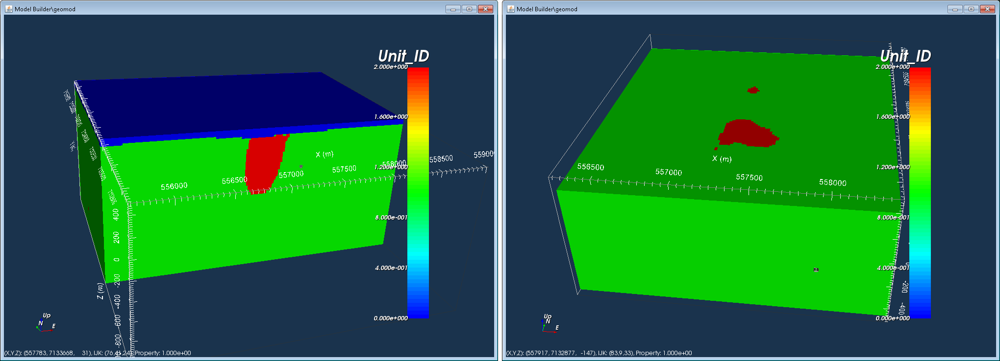

We will first create cell-based weights and then also face weights to show the difference. To create a weights folder, click on the Model Builder object in GIFtools and use the menu: 

- Cell-based weights (Ws): **Build constraints** |rarr| **Weighting functions** |rarr| **From only a geology model** |rarr| **Smallest model (Ws)**

- Face weights (Wx, Wy, Wz): **Build constraints** |rarr| **Weighting functions** |rarr| **From only a geology model** |rarr| **Face weights**

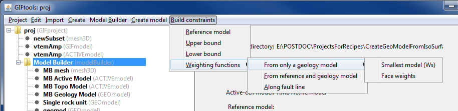

Weights act upon the model objective function and can thus influence the recovered model in the inversion. The model objective function is written as following:

.. math:: \phi_m(m) = \alpha_s\int\limits_V W_s\left\{m-m_o \right\}^2 dv + \alpha_x\int\limits_V W_x \left\{\frac{\partial (m-m_o)}{\partial x}\right\}^2dv  + \\ \alpha_y\int\limits_V W_y \left\{\frac{\partial (m-m_o)}{\partial y}\right\}^2dv  + \alpha_z\int\limits_V W_z \left\{\frac{\partial (m-m_o)}{\partial z}\right\}^2dv 

The number of values for Ws is the same as the number of model cells (nx*ny*nz), where each cell is assigned a weight. For face weights, there is a weight on each cell face or each boundary between cells. Thus, the weights have one fewer value in that direction. For example, the weights for the derivative in the x-direction, described by Wx, has (nx-1)*(ny)*(nz) values.

The default value for cell-based weights and face weights is 1.

.. tip:: A cell-based weight that is less than 1 will allow the model to deviate from the reference model while a cell-based weight greater than 1 will force the model to stay close to the reference model.

.. tip:: A face weight that is less than 1 will create a **sharp** boundary between those cells. A face weight that is greater than 1 will avoid sharp boundaries between those cells. The larger the deviation from 1, the more pronounced the differences will be. For example, a face weight of 0.0001 will produce a sharper boundary than a face weight of 0.1.

.. tip:: Finding the "right" weighting values takes a bit of playing around and is dependent on the problem and the desired outcome.

Create cell-based weights
-------------------------

We will first assign weights to the different unit within the geology model. To do so, click on the geology model and use the menu to navigate: **Geology Model** |rarr| **Geology definition** |rarr| **Edit**.

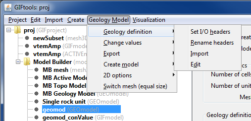

This brings up the geology definition (shown below), containing different columns which are dependent on how the model was created. In this case, the model was generated :ref:`using an isosurface <IsoSurfaceToGeoModel>`. There are additional columns from this geology model was used to :ref:`generate a property model <propModelFromGeoModel>`.

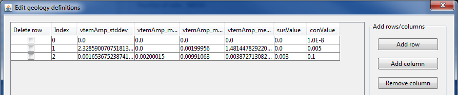

Add a column by clicking "Add column". This brings up a window to enter the column name. "Cancel" will exit out of the window. There are two types of column that can be added. "Value" creates a column for numeric values (such as physical property values or weight values). "String" creates a column for non-numeric values (such as geologic rock names, unit names, or notes). We are naming our new column "WS" and clicking on "Value". The window will close and the new column will appear in the geology definition.

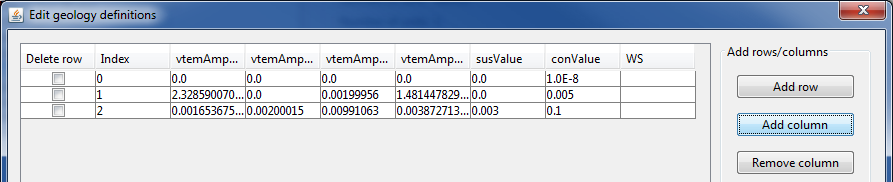

Recall that unit 2 is the anomalous body. We will assign that a weight of 0.0001 and the other units (air and background) a weight of 1.

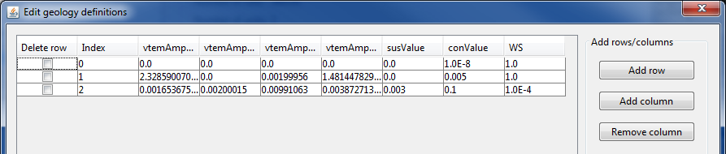

Then click OK to close the geology definition window. The next step is to set the I/O header for the Ws weights. To do so, click on the geology model and use the menu to navigate: **Geology Model** |rarr| **Geology definition** |rarr| **Set I/O headers**.

The following window appears and shows that nothing is set for the Ws. Use the drop menu to select the appropriate column, which in our case is "WS". 

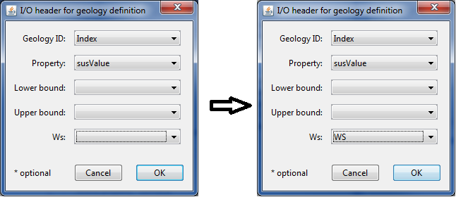

Then click OK. The info panel for the geology model will reflect the change and show what property has been assigned to Ws.

As described above, use the menu to build smallest model (Ws) weights. 

The following window will appear to select the desired geology model:

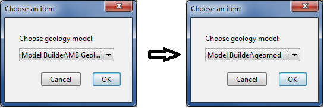

For this example, we select the model "geomod", which is a :ref:`geologic model created from an isosurface <IsoSurfaceToGeoModel>`. Then click OK. A new folder called "MB Weighting functions (GIFweight)" appears under Model Builder:

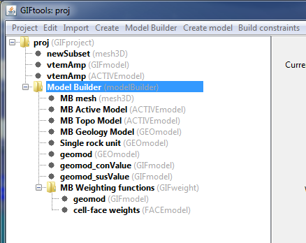

The folder contains two weighting functions:

- geomod (GIFmodel): This is the cell-based weights function we just created. It has the same name as the geology model we used to create it.

- cell-face weights (FACEmodel): This is the face weight object. Because we did not create any specific face weights, all values will be 1.

To view the cell-based weights, click on the model and use the menu: **Visualization** |rarr| **VTK view**. Use the scroll bar or boxes to cut remove cells that have a value of 1. We then see where we assigned smaller weights:

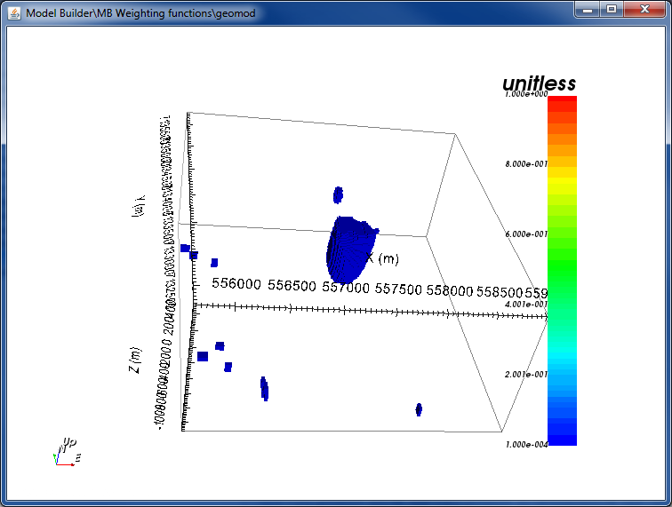

To use these weights in an inversion, create an inversion object and edit the inversion options. For the weights, select the weighting folder we just created and GIFtools will write out the weights in the correct format for that specific inversion and code.

Create face weights
-------------------

To create face weights, select Model Builder and use the menu as described earlier. Select "Face weights".

The following window will appear to select the desired geology model:

For this example, we select the model "geomod", which is a :ref:`geologic model created from an isosurface <IsoSurfaceToGeoModel>`. Then click OK.

The following window appears:

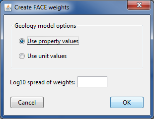

We can either create face weights based on property values or unit values. Recall that for this property model, we have susceptibility and conductivity values assigned to each unit from when we :ref:`created a property model <propModelFromGeoModel>`.

With "Use property values" selected, GIFtools requires a Log10 spread between the weights. For example, a value of 2 means a weight difference of 100 between different units.

In this case, we will use unit values to determine our face weights. When "Use unit values" is selected, GIFtools requires a weight value between units. In this case, we will use 1E-4 to create sharp boundaries between the background and anomaly in our geology model.

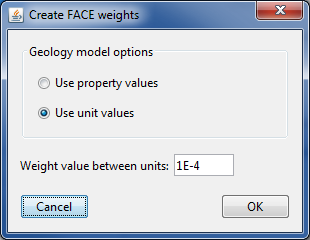

Click OK to apply and close the window. A second GIFweight folder appears under Model Builder.

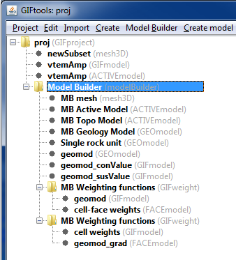

The folder contains two weighting functions:

- cell weights (GIFmodel): This is the cell-based weights object. Because we did not create any specific cell-based weights, all values will be 1. 

- geomod_grad (FACEmodel): This is the face weight object we just created. It has the same name as the geology model we used to create it plus a suffix of "_grad".

To view the face weights, click on the model and use the menu: **Visualization** |rarr| **VTK view/edit**. GIFtools will ask if values of 1 should be ignored. Select "Yes" as this makes visualization of non-unity values much easier. 

The model shows face weights along the air/background interface and at the background/anomaly interface as those were the units defined in the geology model:

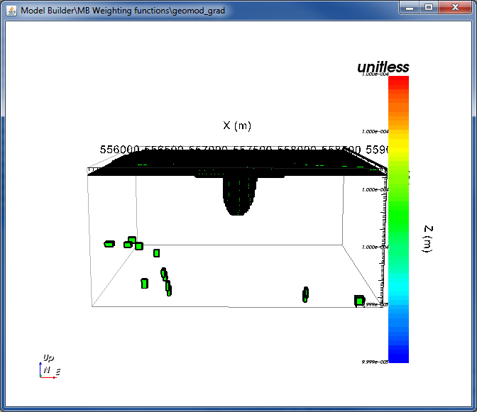

Slice through the top to see the weights around the edge of the anomaly. The face weights form a shell on the boundary of the background and anomaly.

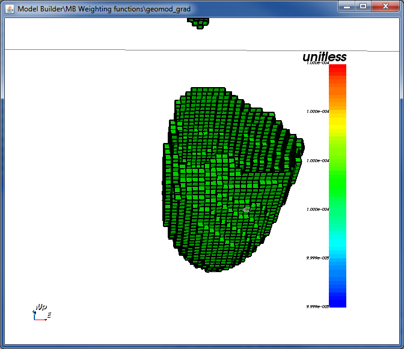

To use these weights in an inversion, create an inversion object and edit the inversion options. For the weights, select the weighting folder we just created and GIFtools will write out the weights in the correct format for that specific inversion and code.

Using both cell-based and face weights
--------------------------------------

Note that the steps in this recipe created **TWO** weighting folders. If we want to use both cell-based weights and face weights in an inversion, select one of the last weighting folders (which has the generated face weights) and use the menu: **Weighting functions** |rarr| **Set model** |rarr| **Cell weighting**.

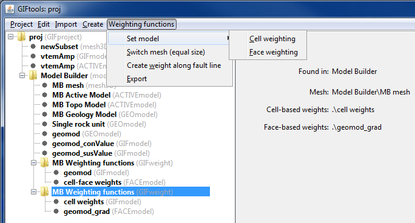

The following window will appear:

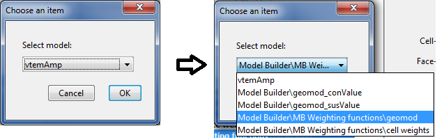

Select the desired model, which in this case is "Model Builder\MB Weighting functions\geomod". Then click OK. The model has been copied and added to this weighting folder and the info panel now shows that "geomod" is set for the cell-based weights.

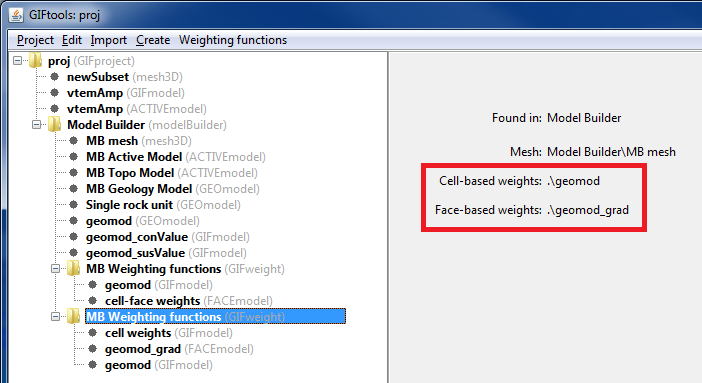

In an inversion, selected this weighting folder will write out both non-unity cell-based (Ws) weights and non-unity face weights.

Alternatively, we could have selected the first weighting folder and used the menu: **Weighting functions** |rarr| **Set model** |rarr| **Face weighting** to add the FACEmodel.

.. tip:: Whichever way you add one weighting object to the other, it can quickly become confusing which weighting folder contains what. We recommend renaming folders from "MB Weighting functions" to something specific to prevent confusion when selecting folders in an inversion's options.

.. note:: You cannot delete weighting folders while they are being used by Model Builder. You can change which weighing folder it is using by clicking "Model Builder" and using the menu: **Model Builder** |rarr| **Set Model** |rarr| **Weights**. In the window that appears, select the desired weighting folder. The info panel shows which functions are set (another reason to rename weighting folders!). Weighing folders that are not set by Model Builder can be deleted.

.. note:: You cannot delete a GIFmodel and FACEmodel that are set within a weighting folder. Once a different model is set (as done above with the cell-based weights), an un-set model can be deleted.

